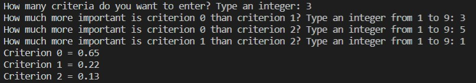

# Analytic hierarchy process

## :mortar_board: About 
This is my regular university assignment. The task was to write a program that could implement the Thomas Saati hierarchy analysis method for a single level. The analytic hierarchy process (AHP) is a structured technique for organizing and analyzing complex decisions, based on mathematics and psychology. It was developed by Thomas L. Saaty in the 1970s who partnered with Ernest Forman to develop Expert Choice in 1983, and has been extensively studied and refined since then. It represents an accurate approach for quantifying the weights of decision criteria. 

Input data is number of criteria that you want to analize and results of pairwise comparison of those criteria. Be aware: ***comparison values have to be integers from 1 to 9 inclusively***. On the output you wil get weights coefficients.



## :computer: Starting
The program is written in Python and works in console. You need to have pipenv installed, because project uses the certain version of *numpy* library.

Requirements are:
- Python >= 3.6
- Pipenv
- Git

In case you don't have pipenv:
```
$ pip install pipenv
```

Please follow these instructions:
```bash
# clone the repository
$ git clone https://github.com/trynke/analytic-hierarchy-process.git
# activate the virtual environment
$ pipenv shell
# start the project
$ python caesar_cipher.py
# the program works in console
```
